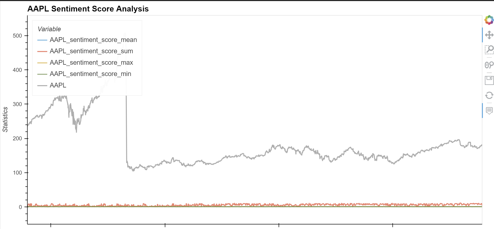
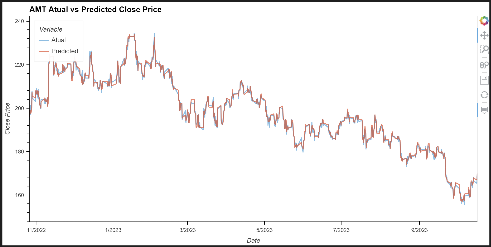
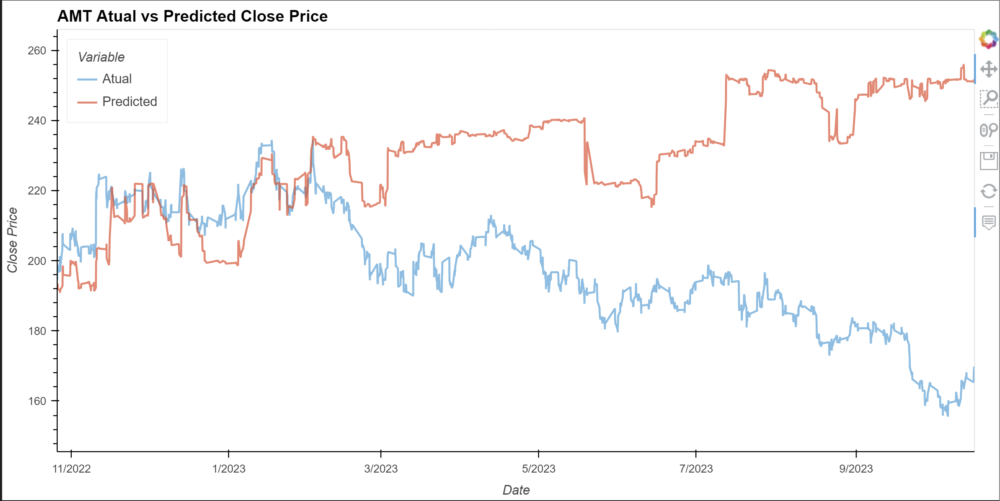

# Stock Price Trend Analysis with Machine Learning and NLP

This project aimed to develop a machine learning model for predicting stock price trends by analyzing historical stock-related news articles and price data.

### Project Outline
1. **Data Collection**:
   - Gathered historical stock price data for the target stocks.
   - Collected a dataset of news articles related to those stocks.

2. **Data Preprocessing**:
   - Cleaned and preprocessed the text data from news articles, including removing stopwords, tokenization, and stemming/lemmatizing.

   - Prepared the historical stock price data, including feature engineering and handling missing values.

3. **Feature Engineering**:

    In this project, feature engineering played a crucial role in enhancing the predictive power of the machine learning models. The following features were created to capture various aspects of stock price movements and sentiment analysis:

    - **Sentiment Scores**: Sentiment analysis was conducted on news articles and tweets to quantify the overall sentiment related to the target stocks. These sentiment scores were used as input features for the models.

    - **SMA Slow and SMA Fast (Simple Moving Averages)**: Simple Moving Averages were calculated to capture short-term and long-term trends in stock prices, offering insights into potential buy or sell signals.

    - **EMA (Exponential Moving Average)**: The Exponential Moving Average was computed to give more weight to recent data points, helping to identify recent trends and shifts in stock prices.

    - **RSI (Relative Strength Index)**: The Relative Strength Index was calculated as an oscillator that measures the speed and change of price movements. It helps assess whether a stock is overbought or oversold.

    These engineered features provided valuable input to the machine learning models, contributing to the predictive accuracy and effectiveness in forecasting stock price trends.


4. **Model Selection**:
   - Chose machine learning models for stock price prediction, a Linear Regression model and a RandomForestRegressor model.

5. **Model Training and Evaluation**:
   - Split the data into training and testing sets.
   - Trained the selected machine learning models using the training data.
   - Evaluated the models' performance using appropriate metrics, such as Mean Absolute Error and Root Mean Square Error.

6. **Predictions and Visualization**:
   - Made stock price predictions using the trained models.
   - Visualized the predictions against the actual stock price data to assess model accuracy.


## Future Development (Post-Completion)

While the primary objectives of this project have been accomplished, there are several areas for future development and enhancement:

1. **Access to High-Quality Financial News Data**:
   - Consider acquiring access to high-quality financial news data sources that provide more accurate and reliable information for sentiment analysis. Such sources often require licensing or subscriptions due to their valuable and proprietary content. Improved data sources can enhance the accuracy of sentiment analysis, leading to more precise stock price predictions.

2. **Incorporate Sentiment Analysis on Entire Articles**:
   - Enhance the sentiment analysis process by analyzing the sentiment of entire financial news articles rather than just the headlines. This approach can offer more accurate sentiment scores and labels, which can be used as features for stock price prediction models. Analyzing the entire content of articles provides a more comprehensive view of market sentiment.

3. **Two Separate Models for Stock Price Prediction**:
   - Explore the development of two separate machine learning models, each focusing on different aspects of stock price prediction:
     - Model 1: Utilize historical stock price data exclusively.
     - Model 2: Leverage sentiment analysis on entire financial news articles.
   This approach allows for a more in-depth examination of the impact of each component and provides insights into the relative importance of these factors in stock price trends.

4. **Web-Based or Desktop Application**:
   - Extend the project's functionality, consider creating a user-friendly web-based or desktop application. This application could allow users to input stock symbols and receive trend predictions based on the models. Such an application would make the models accessible to a broader audience and enable real-time analysis of various stocks.

These future development possibilities aim to enhance the project's accuracy, complexity, and usability, ensuring that it continues to evolve and provide valuable insights to users.


---

  ## Technologies

The technologies and libraries used in this project include:

  * [Python 3.7](https://www.python.org/) - The core programming language used for development.
  * [JupyterLab 3.4.4](https://jupyter.org/) - An interactive development environment for data science and machine learning.
  * [Pandas 1.3.5](https://pandas.pydata.org/) - A powerful data manipulation and analysis library.
  * [Scikit-Learn 1.0.2](https://scikit-learn.org/stable/) - A popular machine learning library in Python.
  * [Bokeh 2.4.3](https://bokeh.org/) - A Python interactive visualization library for web applications.
  * [Requests 2.28.1](https://docs.python-requests.org/en/latest/) - A Python library for making HTTP requests.
  * [Alpaca Trade API 3.0.0](https://alpaca.markets/) - An API to retrieve price data, news data, and facilitate trading.
  * [Transformers 4.30.2](https://huggingface.co/transformers/) - A library for natural language understanding and processing.
  * [NLTK 3.7](https://www.nltk.org/) - The Natural Language Toolkit for NLP tasks.

Please click on the links to learn more about each technology or library.

---

## Installation Guide

Open your terminal and run the command:

```python
  pip install -r requirements.txt
```
Additionaly, to use NLTK stopwords, download the stopwords resource with the following command:
```
python -m nltk.downloader stopwords
```
This will download the WordNet data to your NLTK data directory:
```
python -m nltk.downloader wordnet
```
You may also need to download omw the first time you run the code:
```
import nltk
nltk.download('omw-1.4')
```

 **Important Note on Model Download and Cache**

This project uses the Hugging Face Transformers library to download and cache NLP models for sentiment analysis. When you run the code for the first time, you might see messages like the one below:

```plaintext
No model was supplied, defaulted to distilbert-base-uncased-finetuned-sst-2-english and revision af0f99b (https://huggingface.co/distilbert-base-uncased-finetuned-sst-2-english).
Using a pipeline without specifying a model name and revision in production is not recommended.
Downloading (…)lve/main/config.json: 100%
629/629 [00:00<00:00, 20.2kB/s]
c:\Users\anafi_0xil91f\anaconda3\envs\dev\lib\site-packages\huggingface_hub\file_download.py:133: UserWarning: (…) see https://huggingface.co/docs/huggingface_hub/how-to-cache#limitations.
To support symlinks on Windows, you either need to activate Developer Mode or to run Python as an administrator. In order to see activate developer mode, see this article: https://docs.microsoft.com/en-us/windows/apps/get-started/enable-your-device-for-development
  warnings.warn(message)
Downloading model.safetensors: 100%
268M/268M [00:40<00:00, 7.15MB/s]
All PyTorch model weights were used when initializing TFDistilBertForSequenceClassification.

All the weights of TFDistilBertForSequenceClassification were initialized from the PyTorch model.
If your task is similar to the task the model of the checkpoint was trained on, you can already use TFDistilBertForSequenceClassification for predictions without further training.
Downloading (…)okenizer_config.json: 100%
48.0/48.0 [00:00<00:00, 2.94kB/s]
Downloading (…)solve/main/vocab.txt: 100%
232k/232k [00:00<00:00, 3.50MB/s]
```
These messages are related to downloading and caching model files. The library attempts to use symlinks for caching, but it might not work as expected on Windows. You can safely ignore these warnings.
If you encounter any issues with these downloads, please make sure you have Developer Mode activated or run Python as an administrator on Windows. For further information, you can refer to this [link](https://learn.microsoft.com/en-us/windows/apps/get-started/enable-your-device-for-development). 

---

## Usage

Clone the repository and open your preferred code editor, such as Visual Studio Code. 

Save your Alpaca Live API Key into an '.env' file at the root of the project.
```
ALPACA_API_KEY = your_alpaca_key
ALPACA_SECRET_KEY = your_alpaca_secret_key
```
Navigate to the project directory and locate the main.ipynb file.

As you navigate through the code, execute each cell in the notebook sequentially to load and prepare the data.

In the comment, it's given an approximate time duration for the loading of news data, which typically takes around 40 minutes, and for the sentiment analysis step, which usually takes another 30 minutes. Please note that actual processing times may vary based on factors such as hardware performance and data size. 

Explore the sentiment labels and score as features. 

Read the comments within the notebook to understand approach taken and analysis.

Visulaize the diferent sentiment score metrics (mean, min, max, sum) compared to the stock price. 



Read the exploratory analysis provided in the text section of the notebook.

Next, run the following code to calculate technical indicators (slow SMA, fast SMA, EMA, RSI) for each ticker and build a Linear Regression machine learning model. Calculate regression metrics to evaluate the model's performance.

When plotting the actual vs. predicted values for the Linear Regression model, you observe a close alignment between the data points and the regression line, indicating strong predictive accuracy.



Afterward, build the Random Forest machine learning model and calculate the regression metrics to evaluate its performance.

When plotting the actual vs. predicted values for the Random Forest Regressor model, you notice a significant deviation of data points from the ideal linear trend, highlighting poor predictive accuracy. 



Read comment section to see possible reasons and solutions.


## Contributors

* Ana Martelo (anafilipamartelo@gmail.com), SNRice

---

## License

MIT